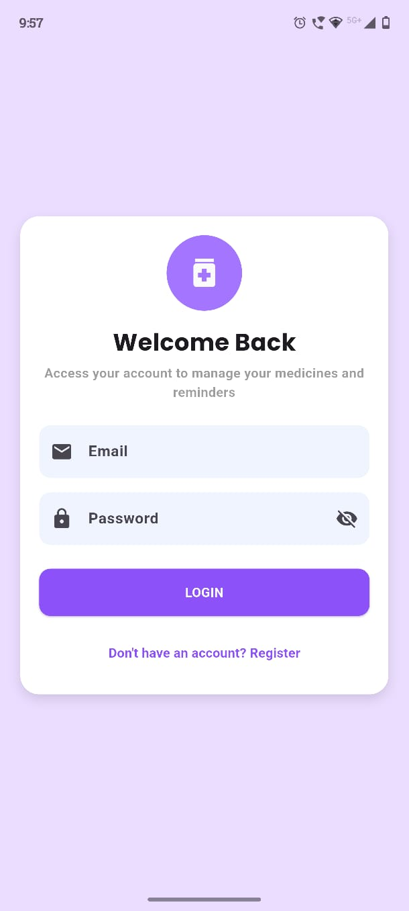
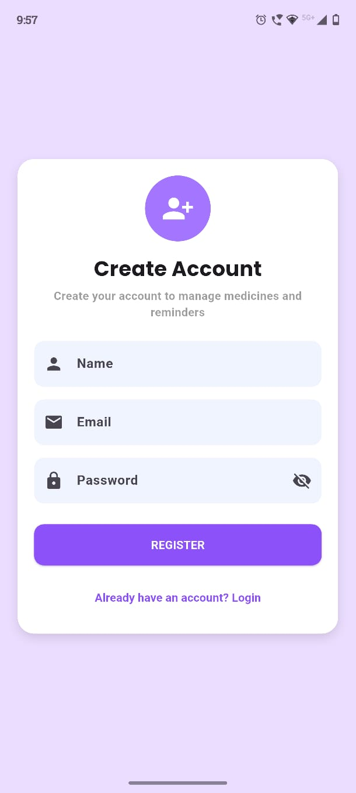
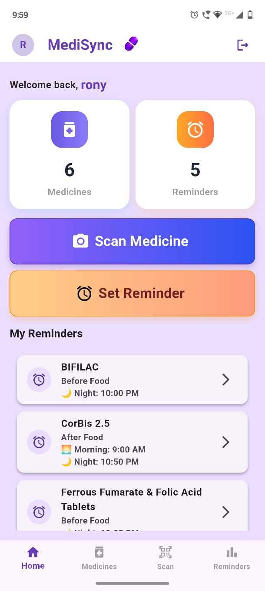
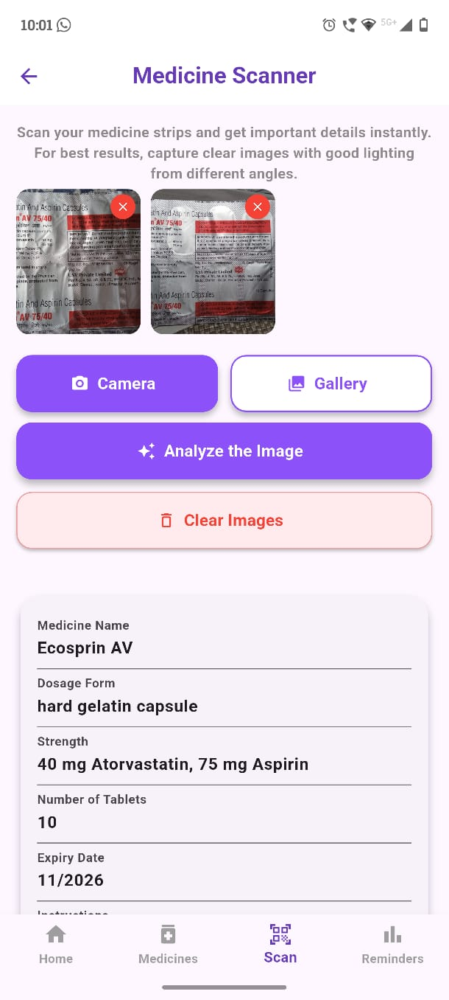
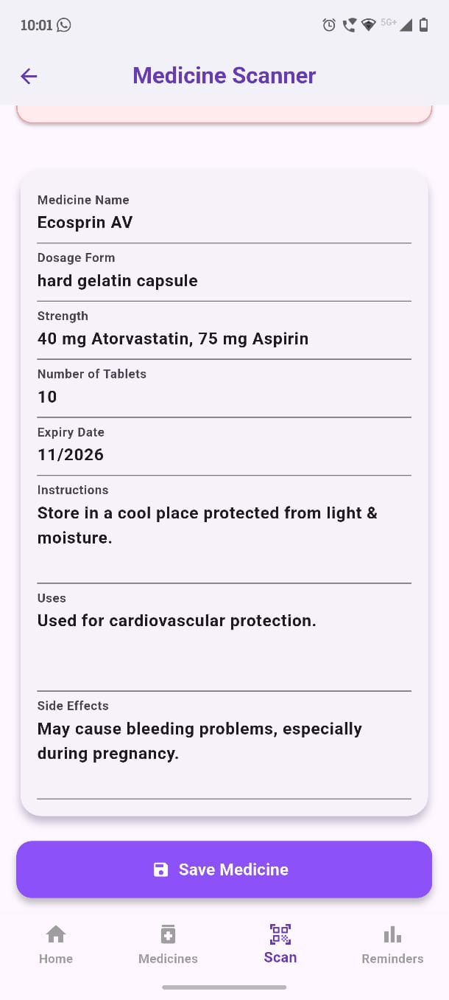
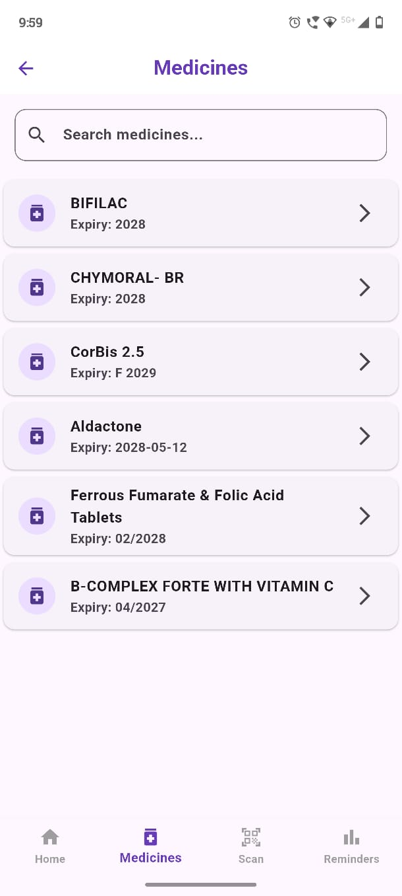
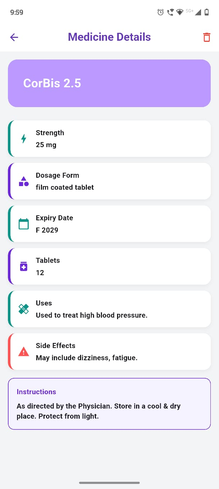
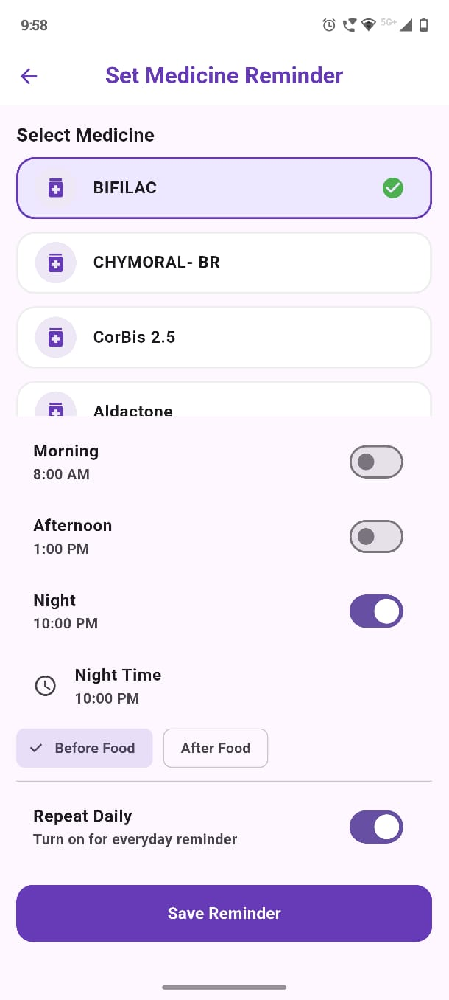
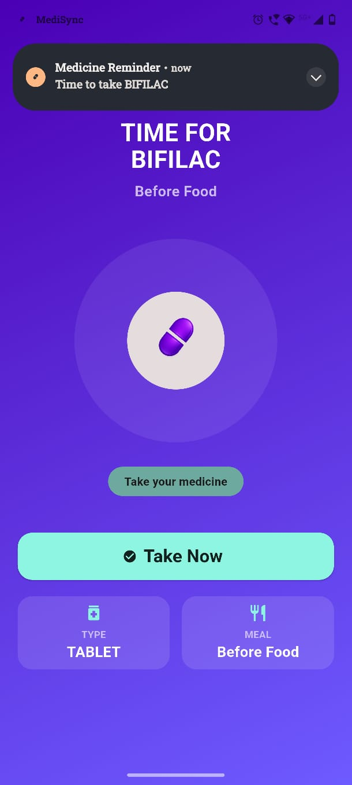

# 💊 MediSync – Smart Medicine Management & Reminder App

MediSync is an intelligent Flutter-based mobile application designed to simplify medicine management. It allows users to scan medicine strips, extract medicine details using OCR and AI, securely store personal medicine records, and set customized medicine reminders with smart alarms.

Built using Flutter, Firebase, Google ML Kit, and AI integration, MediSync aims to improve medication adherence and provide users with an easy way to manage their daily medicines.

---

## ✨ Key Features

* 🔐 **Secure User Authentication**
  Login and registration using Firebase Authentication with user-specific private medicine records.

* 📷 **AI-Powered Medicine Scanner**
  Capture medicine strip images using the camera or gallery, extract text using Google ML Kit OCR, and analyze medicine information using AI.

* 💾 **Personal Medicine Database**
  Store medicine details securely in Firebase Firestore with separate databases for each user.

* ⏰ **Smart Medicine Reminders**
  Create personalized reminders for morning, afternoon, and night schedules with custom timings and meal preferences.

* 🔔 **Full-Screen Alarm System**
  Receive medicine alerts with a dedicated alarm screen showing medicine details and allowing users to stop alarms.

* ✏️ **Medicine & Reminder Management**
  View medicine history, search medicines, and create or edit reminders.

---

## 🛠 Technologies Used

### Frontend

* Flutter
* Dart
* Material Design

### Backend & Database

* Firebase Authentication
* Cloud Firestore

### AI & Image Processing

* Google ML Kit Text Recognition (OCR)
* AI API integration for medicine information analysis

### Device Features

* Camera
* Image Picker
* Local Alarms
* Notifications

---

## 📱 Screenshots

### Login & Registration



### Home Dashboard


### Medicine Scanner



### AI Medicine Details



### Reminder Management


### Alarm Screen


---

## 📂 Project Structure

```plaintext
lib/
│
├── screens/
│   ├── loginpage.dart
│   ├── registerpage.dart
│   ├── homepage.dart
│   ├── scan_page.dart
│   ├── reminder_page.dart
│   ├── edit_reminder_page.dart
│   ├── med_detail_page.dart
│   ├── medicinelist_page.dart
│   └── alarm_ring_page.dart
│
├── services/
│   ├── ocr_service.dart
│   ├── openrouter_service.dart
│   ├── medicine_firebase.dart
│   ├── alarm_service.dart
│   └── notification_service.dart
│
├── models/
│   ├── medicine_model.dart
│   └── medicine_remainder.dart
|
├── main.dart
└── firebase_options.dart
```

---

## 👨‍💻 Developer

Developed with ❤️ using Flutter, Firebase, AI, and modern mobile technologies.
